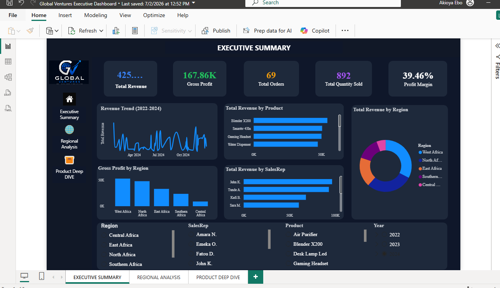
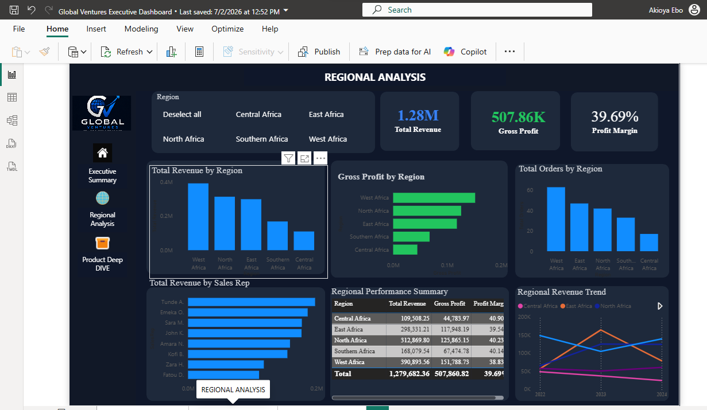
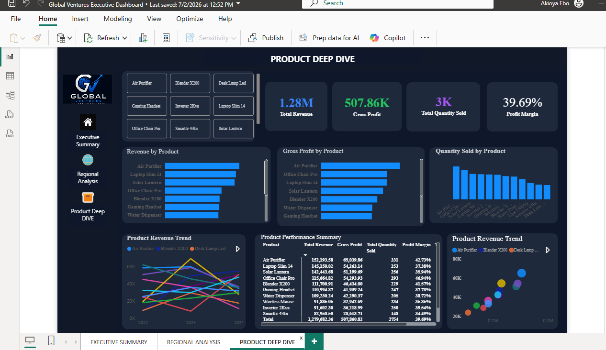

# Global Venture Sales Dashboard | Power BI

## Overview
This project involved developing an interactive Power BI dashboard to analyse sales performance and generate business insights from sales data.

The dashboard provides visibility into revenue trends, product performance, regional performance, and sales representative contributions.

## Tools Used
- Microsoft Power BI
- Power Query
- DAX
- Excel

## Project Objectives
- Clean and transform raw sales data.
- Build a structured data model for reporting.
- Create interactive visualisations to support business decision-making.

## Data Preparation
- Cleaned and transformed data using Power Query.
- Created relationships between tables using a star schema data model.
- Prepared datasets for analysis and reporting.

## Dashboard Features

### Executive Summary
- Key Performance Indicators (KPIs)
- Revenue trends
- Overall sales performance

### Regional Analysis
- Revenue comparison across regions
- Regional performance insights

### Product Deep-Dive
- Product-level performance analysis
- Sales and profitability insights

## DAX Measures Created
- Total Revenue
- Total Profit
- Profit Margin
- Total Orders
- Total Quantity Sold

## Skills Demonstrated
- Data Cleaning
- Data Transformation
- Data Modelling
- DAX Calculations
- Dashboard Development
- Business Intelligence Reporting
- Data Visualisation

## Dashboard Preview

### Executive Summary Dashboard

### Regional Analysis Dashboard

### Product Deep-Dive Dashboard

## Dashboard Preview
(Add screenshots here)

